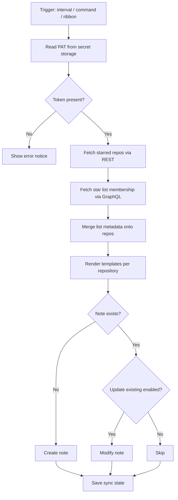

# Architecture

## Module layout

```text
src/
  main.ts                 Plugin lifecycle, commands, sync scheduling
  settings.ts             Settings schema and normalization
  secrets.ts              Secret storage helpers
  constants.ts            Defaults and template variable catalog
  types.ts                Shared interfaces
  github/
    client.ts             GitHub REST API (starred repos, auth test)
    graphql.ts            Shared GraphQL request helper
    starLists.ts          GraphQL star list membership lookup
    enrichRepositories.ts Merge list metadata onto starred repos
    pagination.ts         Link header pagination helper
  template/
    engine.ts             Template rendering and filename sanitization
  sync/
    syncService.ts        Sync orchestration
    noteWriter.ts         Vault folder and file create/update
  ui/
    settingsTab.ts        Plugin settings UI
```

## Sync flow



## Persisted data

Plugin `data.json` contains:

- User settings (folder, templates, sync interval, secret name)
- Sync state (`lastSyncTime`, `lastSyncError`, `repoNotes` map)

Secrets are stored separately by Obsidian and are not part of `data.json`.

## Testing

Unit tests cover template rendering, settings normalization, pagination, secret helpers, GitHub client pagination, and sync notice formatting. UI and Obsidian vault integration are validated manually in Obsidian.
